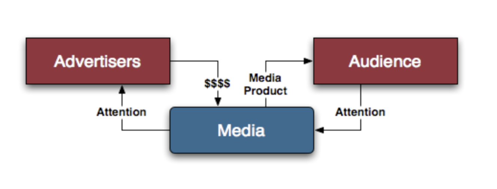

# Intro à l'économie des médias

Internet modifie le marché "cognitif" de l'info, mais il modifie également en profondeur l'industrie des médias en terme de prod. de l'info, rencontre offre/demande, sources de revenu, pratiques de conso, process de valorisation, réglementation...

### Pourquoi s'intéresser à l'économie des médias?

* sciences éco & de la com. : une approche spécifique pour aborder les médias \(interactions entre acteurs du marché, étude des normes, dispositifs techniques...\).
* poids éco modeste des médias, mais influence considérable sur les marchés

### C'est quoi un média?

1. une organisation
2. un marché
3. une histoire
4. un symbole
5. un statut juridique
6. une activité sociale

Comment Internet modifie ces éléments?

### Que produit un média?

* bien exclusif/non exclusif : réservé à un conso. qui paie / bien dont on peut jouir même sans l'avoir payer \(ex: l'éclairage public\).
* bien rival/non rival: bien dont l'utilisation par 1 va empêcher les autres d'en profiter / non rival: on peut le consommer de manière collective \(ex: réseau WiFi, émission à la TV\).
* bien privé / semi-public / commun / public: rival + exclusif \(notre iPhone\) ; exclusif mais non rival ; rival mais non exclusif \(ex: livre à la bibliothèque\).
* bien sous tutelle
* bien éphémère
* bien identitaire
* bien d'expérience

### La structuration du marché des médias

* coûts fixes importants \(n'évoluent pas en fonction de la quantité de biens à produire\)
* coûts variables faibles \(évoluent en fonction de la quantité: l'encre\)
* économies d'échelle: + on produit + on fait baisser les coûts unitaires

Ce qui coûte à un magazine, c'est la distribution \(40% du CA\) et la fabrication \(20%\)

* diminution des ventes =&gt; pression sur la maîtrise des coûts, externalisation du rédactionnel, explosion des piges
* marché biface : la **spirale de Furhoff**
* Concurrence et différenciation

3 **critères**:

1. nature du produit
2. périodicité
3. localisation

3 **sources de revenus**:

1. ventes et abo
2. publicité
3. aides publiques \(+ audience = + aides\)

mutation du marché de la publicité: la part d'Internet augmente, la part de la presse diminue. **concentration des médias**: rationalisation des coûts, danger pour le pluralisme et l'indépendance des médias

Pour résumer, le marché des médias est...

* un marché biface \(1 média a 2 marchés en interaction: rapport média/consommateur + marché publicitaire\)
* un marché fortement différencié
* une structuration des coûts caractérisée par de fortes économies d'échelle

Concept de **convergence** : 

* sur le plan industriel: entre telco / audiovisuel / informatique
* sur le plan culturel: interactions entre "anciens" et "nouveaux" médias

Au final, Internet modifie en profondeur l’industrie des médias, sur plusieurs aspects:

* production de l’information
* rencontre de l’offre et de la demande
* sources de revenu
* pratiques de consommation
* processus de valorisation
* réglementation

