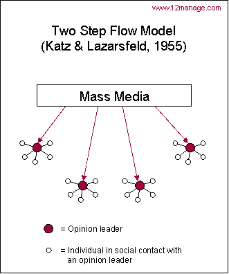

# Médias et classes sociales. Les usages des médias comme composante d'un style de vie

La **dimension sociale** des médias: qui consomme quoi? que font les gens **concrètement** avec les médias? ⟹ déconstruire l'idée que les médias peuvent **influencer la société via les comportements individuels**. On passe ainsi du **paradigme des effets** \(socio déterministe, PDV des dominants\) **aux usages** des médias \(socio de la réception, PDV des dominés\). En France, les chercheurs ont longtemps délaissé le 2nd paradigme pour se focaliser sur le pôle de la production \(discours et pratiques des producteurs, journalistes\).

## Des effets aux usages des médias

Comment les médias influencent \(ou pas\) les audiences?

### Variations médiacratiques autour de la problématique de l’effet des médias

Médiacratie \(=de _média_ et _kratos_ « pouvoir » « souveraineté » en grec, désigne une organisation sociale dominée par les médias\). Une **croyance** qui s'est construite au fil du temps.

Pour quelles **raisons**? ⟹ depuis début 19ème, **transformations structurelles** de la société. Forte industrialisation, exode rural, apprentissage de la démocratie, montée en puissance d'une presse populaire et libre, accélération de la division sociale du travail... On passe d'une société à solidarité **mécanique** à une société à solidarité **organique** \(_DURKHEIM_\) ⟹ **individualisation**.

Dans ce contexte d'**éveil du peuple**, les élites vont développer un fantasme de **la manipulation des foules** passives subissant le pouvoir tout puissant des médias.

* Gustave **LE BON**, _La psychologie des foules_, 1895

La **foule** repose sur bases fondamentalement **IRRATIONNELLES** \(impulsive, crédule, soumise à la suggestion\). Les médias de masse **manipulent** cette foule en créant un **lien social symbolique** entre les récepteurs. Elle se met en mouvement par un **processus IMITATIF** jouant sur le **registre des émotions**/pulsions primaires. Pour _LE BON_, la foule acquiert un **sentiment de puissance notamment par son ANONYMAT.** Il faut donc des **MENEURS DE FOULES**, qui invitent l’individu à rejoindre les autres et à abdiquer sa faculté rationnelle d’agir.

> « Si les électeurs, composés surtout d'ouvriers et de paysans, choisissent si rarement un des leurs pour les représenter, c'est que les personnalités sorties de leurs rangs n'ont pour eux aucun prestige. » — G. LE BON, Psychologie des foules, chap. IV\).

* Scipio **Sighele**, _La foule criminelle_, 1891
* Harold **Lasswell**, _Propaganda in the world war_, 1927

C'est lui qui formalise ce courant d'idée par un modèle structuraliste : la **métaphore de la seringue hypodermique** \(incarne la théorie des effets puissants des médias\). Les 5 étapes \(qui? dit quoi? à qui? par quel canal? avec quels effets?\).

Ces premières théories vont attirer l'**Etat-major** américain qui décide dans les années 30' de **financer cette recherche** par intérêt \(contexte de **guerre psychologique**, on cherche à comprendre comment la propagande agit sur les foules\) ⟹ c'est donc l'enjeu **politique** qui impose sa problématique au monde **académique** en incitant financièrement à voir les médias que par le prisme de la toute-puissance.

* Serge **Tchakotine,** _Le viol des foules par la propagande politique_, 1939

Dénonce les techniques de propagande nazie du ministre nazie, Goebbels. La **propagande repose sur des REFLEXES CONDITIONNES** = GUIDE LES PULSIONS DE L’INDIVIDU DANS LE SENS QU’ON A CHOISI POUR LUI. Les individus **ATOMISES\(séparés\) SONT UNE PROIE + FACILE POUR LES MASSES-MEDIAS** : ils ont perdu leur cadre de référence habituel, donc moins résistants.

Modèle du **stimuli-réponse**: les médias endorment la foule en affaiblissant nos **capacités** de réflexion. Seul les gens éduqués seraient épargnés partiellement, mais pour LE BON, la majorité de la population fait partie des "**violables**" \(=ceux qu'une propagande efficace peut réduire à un état de robot vivant\).

* Paul **Lazarsfeld**, Bernard **Berelson**, Hazel **Gaudet**, _The People’s choice. How the voter makes up his mind in a presidential campaign_ \(1ère édition 1944\)

Une des grandes études financés par l'Etat-major. Mais leurs recherches vont conduire à **invalider la thèse du paradigme médiacratique**. Comment? En inversant la problématique politique. Plus "ce que les médias font aux gens" mais : "ce que les gens font des médias".

Thèse ⟹ l'inertie des opinions et du vote des gens face à la communication médiatique

En menant des entretiens et en analysant la campagne présidentielle américaine de 1940, ils montrent que **les gens ne changent pas d'opinion en fonction de la médiatisation** de la campagne \(seulement 8%\). Pourquoi? Parce que le comportement électoral est un **fait social**, les individus appartiennent à des **groupes primaires d'appartenance**: le candidat qui a les faveurs de l'entourage proche exerce une influence bien plus forte que celle exercée par les médias. Ce n'est ainsi pas uniquement notre opinion qu'il faut mesurer car le vote est une **expérience de groupe**. Paradoxalement, ils observent que les médias ont une fonction de **rappel d'appartenance** à ce groupe, à rassurer et à consolider sa cohésion.

* Bernard **Berelson**, Paul **Lazarsfeld** & William **McPhee**, _Voting. A study of Opinion Formation in a Presidential Campaign_, 1954.

2ème étude de la série visant à poursuivre les premiers résultats: **comment expliquer cette inertie?**

Thèse ⟹ Modèle des **effets limités/indirects des médias**: les groupes primaires d'appartenance tamisent, sélectionnent l'information consommée selon leurs propres caractéristiques sociales.

Les personnes qui appartiennent au même groupe social ont un _habitus_ commun, des **manières de voir** le monde convergentes &gt; tendance alors à interpréter un message à partir des **normes** sociales, morales communes. Rôle de **médiateur** du groupe: n'accorder de l'attention qu'aux messages compatibles avec notre conception du monde, occulter ce qui dérange. Influence du groupe sur 3 aspects : **le positionnement politique** ; **l'échelle de légitimité des médias** \(quels médias il faut consommer, lesquels fuir\) ; le **degré d'exposition** \(certains groupes consomment plus de médias que d'autres, exerçant donc une influence sur notre conso. individuelle\).

L'exposition au message se fait alors **sélective** : on ne retient que les messages allant dans notre sens, notre attention se fixe sur ce qui renforce nos **opinions préalables**. Les chercheurs concluent donc sur un **second paradoxe**: plutôt que de changer les opinions, les médias **renforcent** les croyances établies.

* Elihu **Katz**, Paul **Lazarsfeld**, _Personal Influence. The part played by people in the flow of mass communications,_ \(1955\)

> « Les idées coulent souvent de la radio et de l'imprimé vers les leaders d'opinion, et des leaders d’opinion vers les segments les moins actifs de la population » — LAZARSFELD/KATZ

L'interprétation des messages est à comprendre par les **relations interpersonnelles**, la **conversation** noués entre les individus.

Concept du **leader d'opinion**: un individu qui a une crédibilité au sein d'un groupe, qui est estimé, écouté. Il incarne les valeurs du groupe \(**conformité**\) en jouant le rôle de _gatekeeper_ entre les médias et les membres de son groupe \(transmet ou rejette l'information à communiquer\).

L'information passe par **2 étapes**. D'abord, les leaders d'opinions, ceux qui s'exposent le plus aux médias au sein d'un groupe, reçoivent l'information. Ensuite, ces leaders d'opinions relaient **leur interprétation personnelle** de cette information aux membres du groupe. Les messages des médias sont donc eux-même médiés avant d'arriver au récepteur.

**Bilan de la série des 3 études**

* Poids du groupe d'appartenance au conformisme via le leader d'opinion
* L'exposition aux messages est sélective
* Effet des médias de renforcement des opinions préexistantes

* **Blumer & Katz**, _The uses of mass communications: Current perspectives on gratifications research_, 1974
* **Bernard Cecil Cohen**, _The Press and Foreign Policy_, Princeton, Princeton University Press, 1963
* **McCombs \(M.\) and Shaw** \(D. L.\), _«The Agenda-Setting Fonction of Mass Media»_, Public Opinion Quaterly, 36, 1972, pp. 176-187
* **Cobb \(R. W.\) and Elder \(C. D.\)**, _«The Politics of Agenda-Building: An Alternative Perspective For Modern Democratic Theory»_, The Journal of Politics, vol 33, number 3, august 1971, p. 892-915
* Shanto **Iyengar**, _Is Anyone Responsible ? How television frames political issues_, Chicago, Chicago University Press, 1991.
* Elisabeth-Noelle **Neumann**, _« La spirale du silence »_, Hermès, no 4, CNRS éditions, Paris, 1989 \(1974\), traduction de Gilles Achache, Dorine Bregman, Daniel Dayan \(online\)

### Les études de « réception »

* Richard **Hoggart**, _The Uses of Literacy : Aspects of Working-Class Life_, 1957 ; traduit en 1970 aux éditions de Minuit sous le titre : La culture du pauvre.\*
* David **Morley**, _The “Nationwide” Audience: Structure and Decoding_, 1980
* Greg **Philo**, _Seeing and Believing. The Influence of Television,_ 1990
* William **Gamson**, _Talking Politics_, Cambridge, Cambridge University Press, 1992; pour une présentation critique de ce travail, voir: NEVEU \(Erik\), « Ce que parler politique veut dire », Revue française de science politique, 1994, vol.44, n°5, p. 934-939.
* Elihu **Katz** & Tamar **Liebes**, _The export of meaning. Cross cultural readings of Dallas_, 1993
* Pierre **Bourdieu** et Jean-Claude **Passeron**, « _Sociologues des mythologies et mythologies des sociologues_ », Les Temps Modernes, 1963
* Janice **Radway**, _Reading the romance_, 1984
* Michel **De Certeau**, _L’invention du quotidien, 1. Arts de Faire,_ 1980
* Dominique **Pasquier**, _La culture des sentiments. L’expérience télévisuelle des adolescents_, 1999

### Sortir de la problématique de l’effet des médias sur les « gens » en inversant et en sociologisant le questionnement 

-&gt; L’indissociabilité du processus de communication

Définition du jour: **Classes sociales**

* Serge **Bosc**, _Stratification et classes sociales. La société française en mutation_, Paris, Armand Colin, 2013 \(7ème édition\)
* Rémi **Lenoir**, « _Espace social et classes sociales chez Pierre Bourdieu_ », Sociétés et représentations, 2004, vol. 1, n°17
* Louis **Chauvel**, « _Le retour des classes sociales ?_ », Revue de l’OFCE, n°79, 2001, p. 317

## Légitimités symboliques, usages des médias d’information et styles de vie

### Les théories de la légitimité culturelle en débat

~~b\) Normes de la légitimité informationnelle et inégalités sociales face aux news  
c\) Remarques sur les données d’audience et sur ce qu’internet change et ne change pas~~

## Bibliographie indicative

* Will **Atkinson**, _Class, Individualization and Late Modernity: In Search of the Reflexive Worker_, Palgrave Macmillan, 2010
* Jean-Baptiste **Comby**, « _L’orientaton sociale des goûts en matière d’actualité_ », in Josiane Jouët, Rémy Rieffel \(dir.\), S’informer à l’ère numérique, Rennes, PUR, 2013 \(pagination à venir\)
* Philippe **Coulangeon**, _Les métamorphoses de la distinction. Inégalités culturelles dans la France d'aujourd'hui_, Paris, Grasset, 2011\*
* Eric **Darras**, « _Le pouvoir de la télévision ? Sornettes, vieilles lunes et nouvelles approches_ », in Cohen A, Lacroix B, Riutort P \(dir.\), Les formes de l'activité politique. Eléments d'analyse sociologique \(18ème – 20ème siècles\), Paris, Presses Universitaires de France, 2006, p. 466-467.
* Daniel **Gaxie**, _Le cens caché. Inégalités culturelles et ségrégation politique_, Paris, Seuil, 1978.
* Daniel **Gaxie**, « _Une construction médiatique du spectacle politique ? Réalités et limites de la contribution des médias au développement des perceptions négatives du politique_ », in Lagroye Jacques \(dir\), La politisation, Paris, Belin, 2003, 325-356.
* Vincent **Goulet**, _Médias et classes populaires. Les usages ordinaires des informations,_ Paris, INA Editions, 2010.
* Bernard **Lahire**, _La culture des individus, dissonances culturelles et distinction de soi_, Paris, La Découverte, 2004
* Gérard **Mauger**, Claude Poliak et Bernard Pudal, _Histoires de lecteurs,_ réédition, Broissieux, éditions du Croquant, Coll. « Champ social », 2010 \(1ère édition 1999, éditions Nathan\).
* Jean-Claude **Passeron**, Claude Grignon, _Le Savant et le Populaire. Misérabilisme et populisme en sociologie et en littérature_, Paris, Seuil, 1989.
* Voir également : Claude **Grignon**, Annie **Collovald**, Bernard **Pudal**, Frédéric **Sawicki**, « _Un savant et le populaire. Entretien avec Claude Grignon_ », Politix, vol. 4, n°13,1991, pp. 35-42 \(online\)\*\*  

